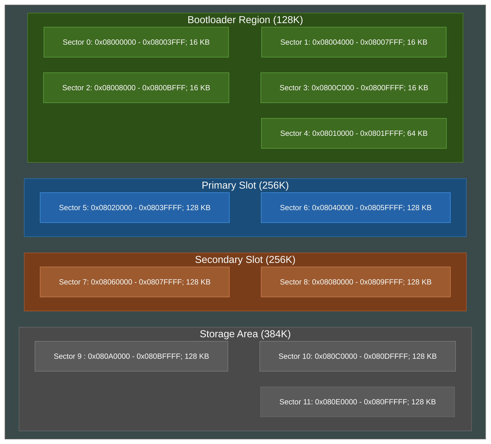

# Wicked Boot

Modern bootloader for STM32.
Based on mcuboot v1.7.2

todo:
- [X] Simple boot
- [X] USB-DFU support
- [X] WebUSB support

### STM32F407VG Memory layout

```mermaid
flowchart TB

    %%{init: {'flowchart': {'nodeSpacing': 25, 'rankSpacing': 1,'useMaxWidth': false}}}%%
    subgraph STM32F407[" "]
        direction TB
        
        subgraph BOOT["Bootloader Region (128K)"]
            B1["<nobr>Sector 0: 0x08000000 - 0x08003FFF; 16 KB</nobr>"]
            B2["<nobr>Sector 1: 0x08004000 - 0x08007FFF; 16 KB</nobr>"]
            B3["<nobr>Sector 2: 0x08008000 - 0x0800BFFF; 16 KB</nobr>"]
            B4["<nobr>Sector 3: 0x0800C000 - 0x0800FFFF; 16 KB</nobr>"]
            B5["<nobr>Sector 4: 0x08010000 - 0x0801FFFF; 64 KB</nobr>"]
            B1 ~~~ B2
            B3 ~~~ B4
        end
        
        subgraph PRIMARY["Primary Slot (256K)"]
			P1["<nobr>Sector 5: 0x08020000 - 0x0803FFFF; 128 KB</nobr>"]
			P2["<nobr>Sector 6: 0x08040000 - 0x0805FFFF; 128 KB</nobr>"]
			P1 ~~~ P2
        end
        
        subgraph SECONDARY["Secondary Slot (256K)"]
			S1["<nobr>Sector 7: 0x08060000 - 0x0807FFFF; 128 KB</nobr>"]
			S2["<nobr>Sector 8: 0x08080000 - 0x0809FFFF; 128 KB</nobr>"]
			S1 ~~~ S2
        end
        
        subgraph SCRATCH["Storage Area (384K)"]
            SC1["<nobr>Sector 9 : 0x080A0000 - 0x080BFFFF; 128 KB</nobr>"]
			SC2["<nobr>Sector 10: 0x080C0000 - 0x080DFFFF; 128 KB</nobr>"]
			SC3["<nobr>Sector 11: 0x080E0000 - 0x080FFFFF; 128 KB</nobr>"]
			SC1 ~~~ SC2
        end

        BOOT ~~~ PRIMARY
        PRIMARY ~~~ SECONDARY
        SECONDARY ~~~ SCRATCH
    end

    style STM32F407 fill:#3a4a4a,stroke:#666,stroke-width:1px,color:#fff
    style BOOT fill:#2d5016,stroke:#4a7c2c,stroke-width:1px,color:#fff
    style PRIMARY fill:#1a4d7a,stroke:#2e6da4,stroke-width:1px,color:#fff
    style SECONDARY fill:#7a3d1a,stroke:#a4562e,stroke-width:1px,color:#fff
    style SCRATCH fill:#4a4a4a,stroke:#666,stroke-width:1px,color:#fff
    style B1 fill:#3d6b1f,stroke:#5a9c3c,stroke-width:1px,color:#fff,font-size:12px
    style B2 fill:#3d6b1f,stroke:#5a9c3c,stroke-width:1px,color:#fff,font-size:12px
    style B3 fill:#3d6b1f,stroke:#5a9c3c,stroke-width:1px,color:#fff,font-size:12px
    style B4 fill:#3d6b1f,stroke:#5a9c3c,stroke-width:1px,color:#fff,font-size:12px
    style B5 fill:#3d6b1f,stroke:#5a9c3c,stroke-width:1px,color:#fff,font-size:12px
    style P1 fill:#2563a8,stroke:#3d8ad4,stroke-width:1px,color:#fff,font-size:12px
    style P2 fill:#2563a8,stroke:#3d8ad4,stroke-width:1px,color:#fff,font-size:12px
    style S1 fill:#9c5a2e,stroke:#c47a4a,stroke-width:1px,color:#fff,font-size:12px
    style S2 fill:#9c5a2e,stroke:#c47a4a,stroke-width:1px,color:#fff,font-size:12px
    style SC1 fill:#5a5a5a,stroke:#777,stroke-width:1px,color:#fff,font-size:12px
    style SC2 fill:#5a5a5a,stroke:#777,stroke-width:1px,color:#fff,font-size:12px
    style SC3 fill:#5a5a5a,stroke:#777,stroke-width:0.5px,color:#fff,font-size:12px
```
